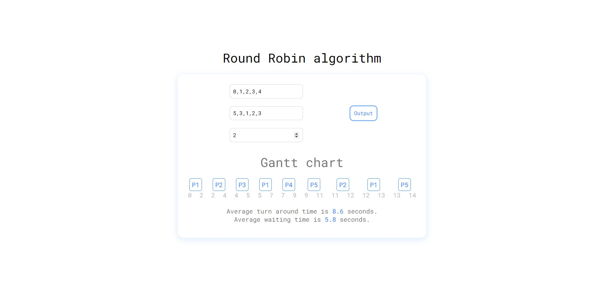
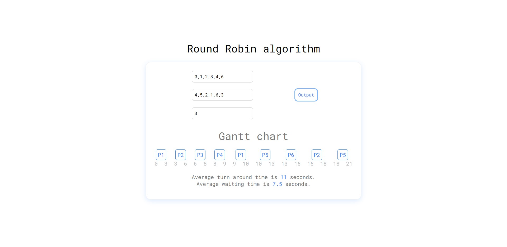
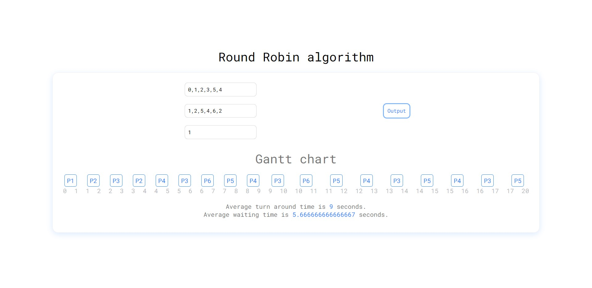

# Round-Robin-Scheduling

Round Robin scheduling algorithm of operating systems.

    

        
        

            github.com /
            <code>
            <a href="https://github.com/patelka2211/Round-Robin-Scheduling" title="patelka2211/Round-Robin-Scheduling on GitHub" target="blank_" style="cursor: pointer;">
                <a href="https://github.com/patelka2211" title="patelka2211 on GitHub" style="text-decoration: none;color: #58a6ff;" target="blank_">patelka2211</a> / <a href="https://github.com/patelka2211/Round-Robin-Scheduling" title="patelka2211/Round-Robin-Scheduling on GitHub" style="text-decoration: none;color: #58a6ff;" target="blank_">Round-Robin-Scheduling</a>
            </a>
        </code>
        

        

            <a href="https://patelka2211.github.io/Round-Robin-Scheduling" title="patelka2211/Round-Robin-Scheduling on GitHub Pages" style="text-decoration: none;color: #58a6ff;" target="blank_">patelka2211 / Round-Robin-Scheduling</a> on GitHub Pages.
        

    

# Description

Round Robin algorithm is used by operating system to schedule running processes.

# Examples

# Languages

Same code is available in JavaScript and Python.

# About languages

|                                                                Total used languages                                                                 |                                     Top language                                     |
| :-------------------------------------------------------------------------------------------------------------------------------------------------: | :----------------------------------------------------------------------------------: |
|  |  |

&copy; 2022
<a href="https://github.com/patelka2211" title="Kartavya Patel" style="margin-left: 5px;">Kartavya Patel</a>

